## 📌 Project Overview
This project demonstrates the design and deployment of a secure multi-tier web application on AWS using managed services and cloud best practice

## 🛠️ Technologies Used
- Amazon EC2
- Amazon RDS (MySQL)
- Amazon S3
- Amazon DynamoDB
- Application Load Balancer
- Amazon Route 53
- NAT Gateway
- IAM
- Amazon VPC

## 🌐 Architecture Design
- Web servers deployed in **private subnets**
- NAT Gateway for secure outbound internet access
- A public ALB routes internet traffic to EC2 instances in private subnets, ensuring secure access and high availability.
- Route 53 for DNS and traffic routing
- RDS for structured data
- S3 for storing images
- DynamoDB for metadata

## 🔐 Security Implementation
- IAM roles with least-privilege access
- Private subnets for backend resources
- Security Groups and NACLs
- No public access to databases

## 📈 Performance & Optimization
- Achieved **99.9% uptime**
- Reduced latency to **<100ms** using ALB
- Optimized storage costs by **~25%**

## 📸 Implementation Screenshots

### VPC Design
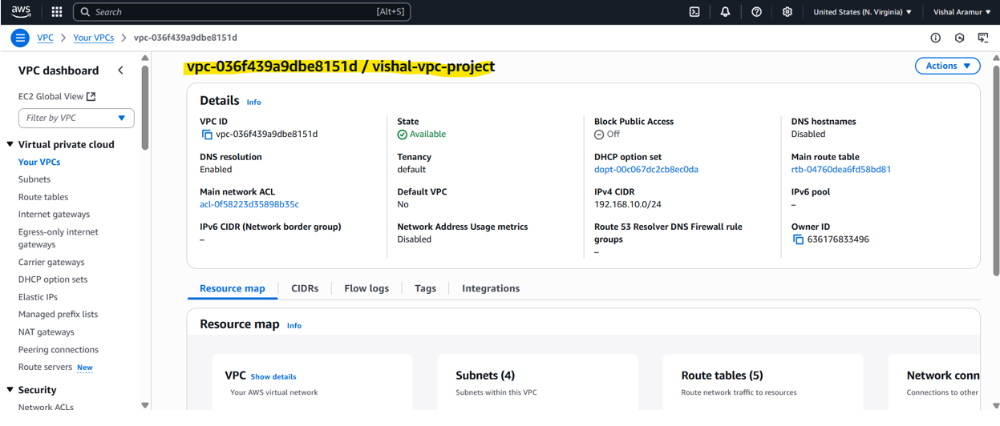

### Subnets
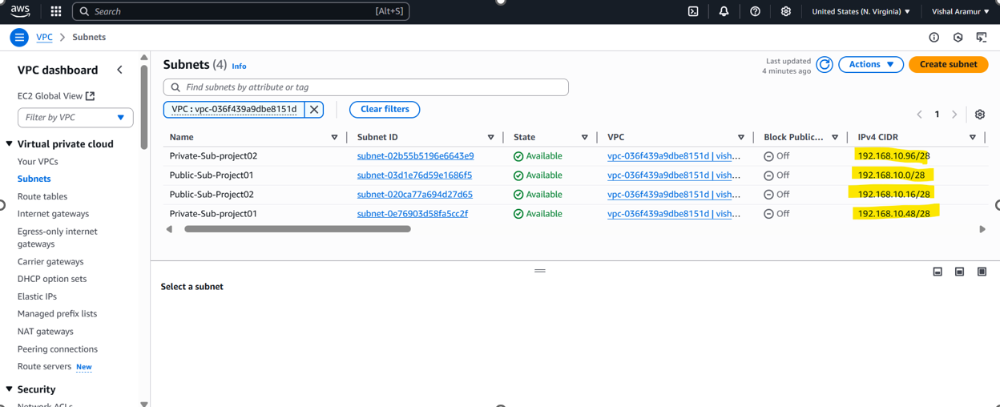

### Internet Gateway
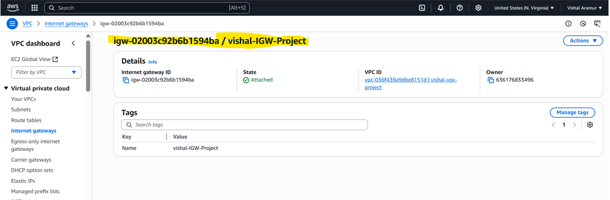

### NAT Gateway

### Route Tables
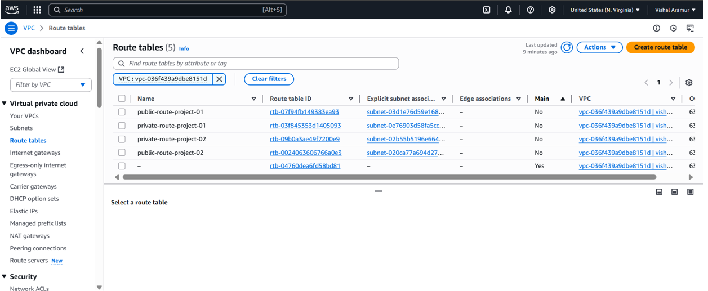

### Route Tables Config
.png)

### Instance-Private_Subnet
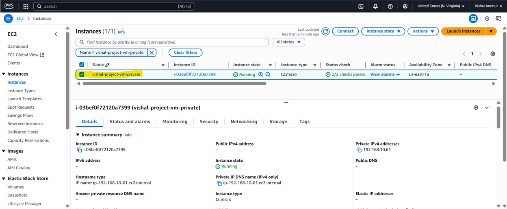

### RDS
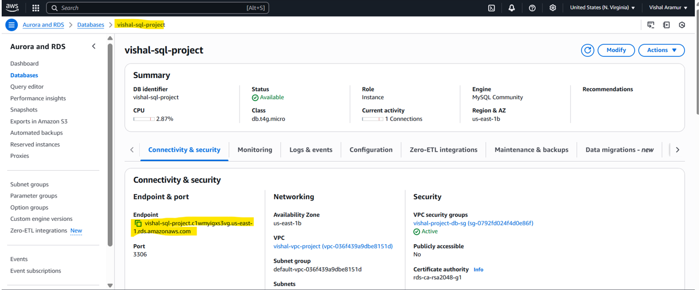

### DynamodbTable
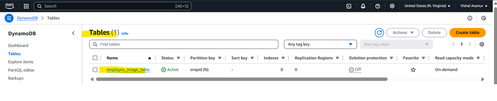

### Route Tables

### S3Bucket

### ApplicationLoadBalancer

### IAM Roles
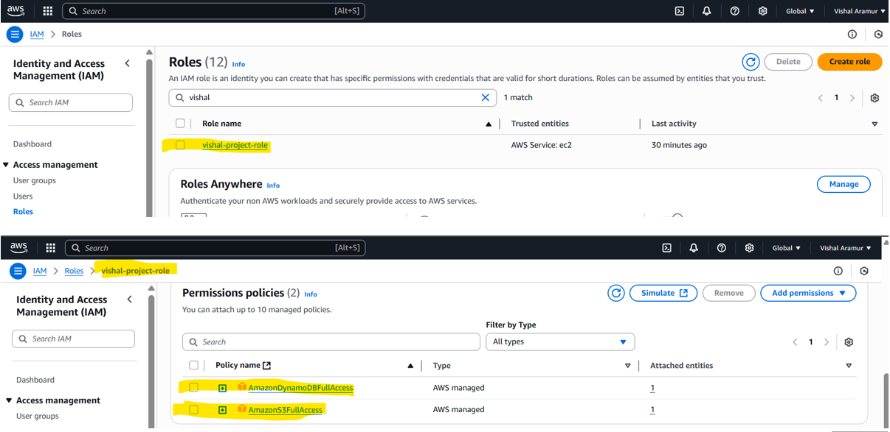

### Instance-Public_Subnet
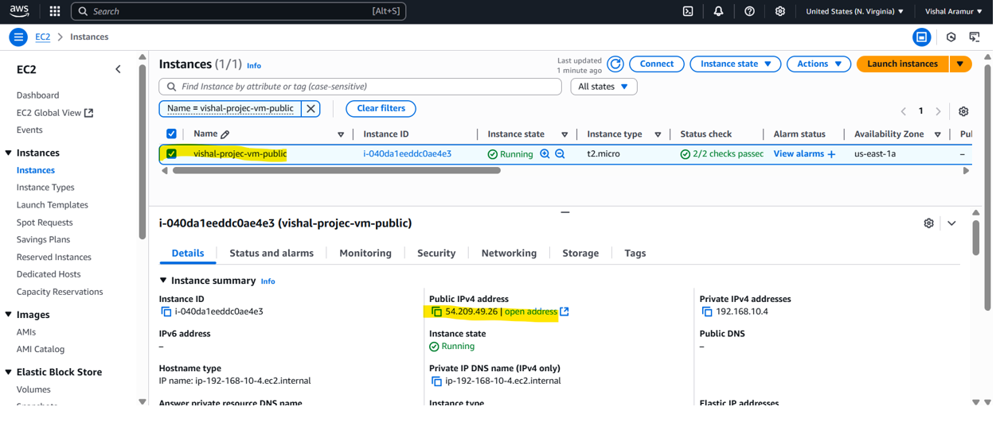

### Public-PrivateInstance_SSH
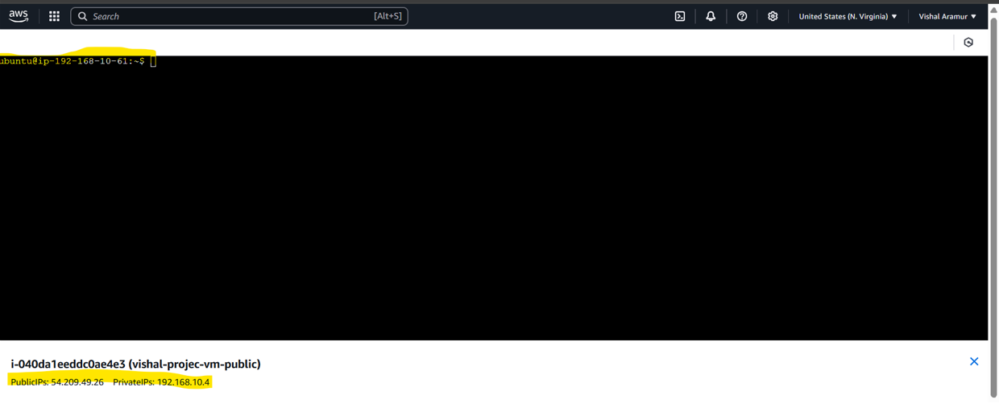

### PythonScript_PrivateInstance
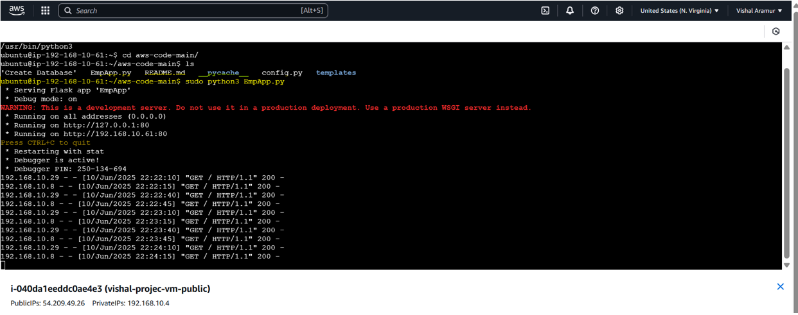

### LoadBalancer-DNS_URL
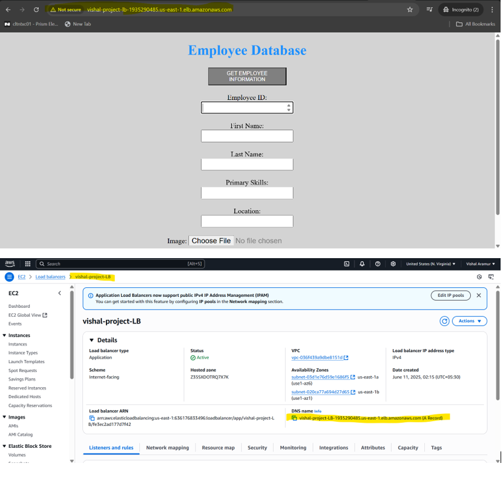

### HostedZone-Route53

### CustomDomainURL
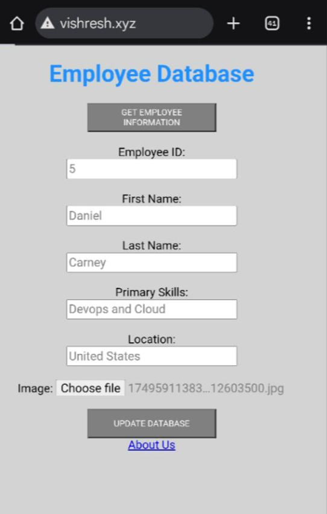

### RDS-Data

### Uploaded-Images-S3

### Metadata-DynamoDB
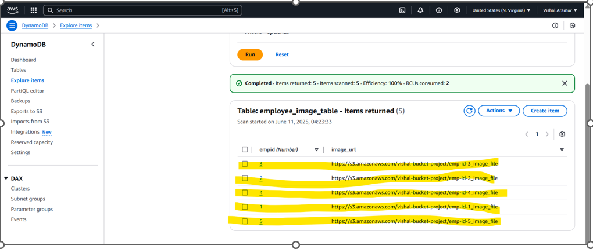

## 📄 Author
**Vishal Aramur**  
Cloud Engineer | AWS | DevOps  

